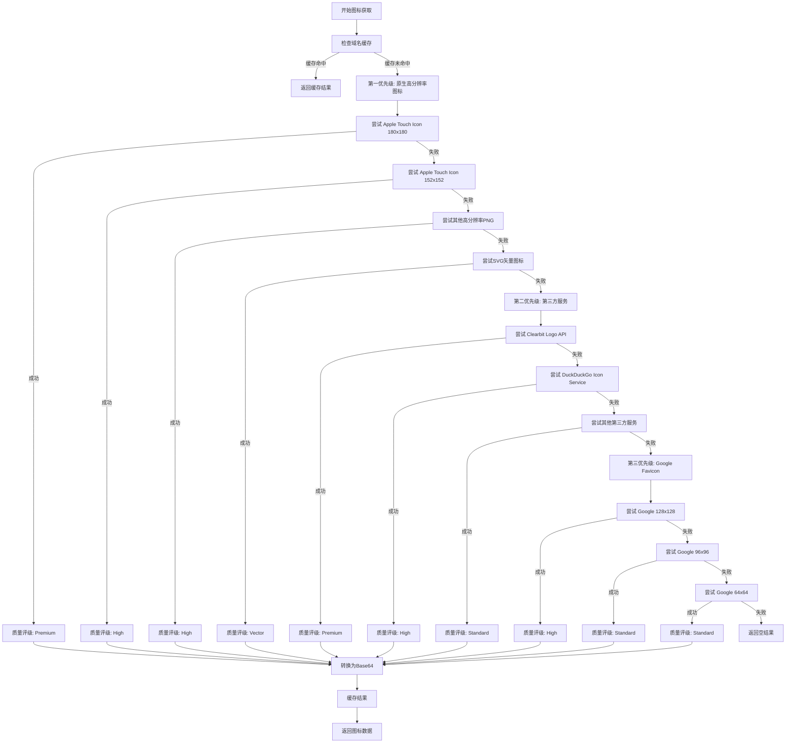
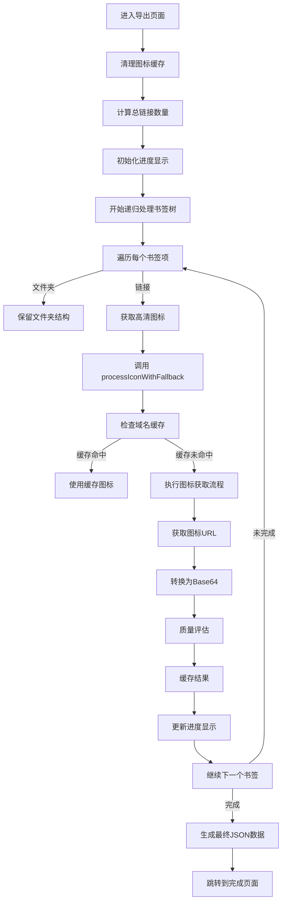

# 📋 Pintree 书签导出器 - 系统架构与逻辑流程文档

## 🏗️ 系统架构概览

### 核心模块结构
```
src/
├── popup/                    # 用户界面层
│   ├── index.tsx            # 路由入口
│   ├── home.tsx             # 首页界面
│   ├── bookmark.tsx         # 书签选择页面
│   ├── export.tsx           # 导出处理页面
│   └── finish.tsx           # 完成下载页面
├── utils/                   # 核心业务逻辑层
│   ├── index.ts             # 图标处理核心逻辑
│   ├── tree.ts              # 树形数据处理
│   ├── wrapper.ts           # 网络请求封装
│   └── bookmark/
│       └── chrome.ts        # Chrome书签API
├── context/                 # 状态管理
│   └── app-context.tsx      # 全局应用状态
├── components/              # UI组件
└── types/                   # 类型定义
```

## 🔄 完整业务流程

### 1. 应用启动流程

```mermaid
graph TD
    A[用户点击扩展图标] --> B[加载首页 home.tsx]
    B --> C[显示功能介绍和开始按钮]
    C --> D[用户点击"开始导出书签"]
    D --> E[路由跳转到 /bookmark]
```

**技术实现**:
- 使用 React Router 进行页面路由管理
- AppContext 提供全局状态管理
- Plasmo 框架处理Chrome扩展生命周期

### 2. 书签获取与选择流程

```mermaid
graph TD
    A[进入书签选择页面] --> B[调用 getChromeBookmarks()]
    B --> C[Chrome API: chrome.bookmarks.getTree()]
    C --> D[递归处理书签树结构]
    D --> E[标记节点类型: folder/link]
    E --> F[渲染可选择的书签树]
    F --> G[用户勾选要导出的书签]
    G --> H[验证选择并启用继续按钮]
    H --> I[点击继续，跳转到导出页面]
```

**核心代码逻辑**:
```typescript
// 1. 获取Chrome书签
const getChromeBookmarks = async () => {
  return new Promise((resolve, reject) => {
    chrome.bookmarks.getTree((bookmarks) => {
      if (chrome.runtime.lastError) {
        reject(chrome.runtime.lastError)
      } else {
        resolve(bookmarks)
      }
    });
  });
};

// 2. 递归处理书签结构
const bookmarks = await recursiveChange<TreeDataNode, ChangedTreeData>(
  result[0].children,
  async (item, _index: number) => ({
    ...item,
    type: item?.children ? "folder" : "link"
  })
)

// 3. 用户选择处理
const handleExportBookmarks = () => {
  const result = recursiveFind<TreeDataNode>(data, (item, _index: number) =>
    checkedKeys.includes(item.id)
  )
  setTreeData(result)
  navigate("/export")
}
```

### 3. 高清图标获取流程

这是系统的核心创新部分，采用多层级策略确保图标质量：



**核心技术实现**:

#### 3.1 多源图标URL生成
```typescript
// 原生高分辨率图标URLs（按优先级排序）
export const getCommonIconUrls = (url: string): string[] => {
  const domain = new URL(url).origin;
  return [
    `${domain}/apple-touch-icon-180x180.png`,  // 最高质量
    `${domain}/apple-touch-icon-152x152.png`,  // 高质量
    `${domain}/icon-192x192.png`,              // 高分辨率
    `${domain}/favicon.svg`,                   // 矢量图标
    `${domain}/favicon-96x96.png`,             // 标准清晰
    `${domain}/favicon.ico`,                   // 传统格式
    // ... 更多格式
  ];
}

// 第三方高质量服务URLs
export const getThirdPartyIconUrls = (url: string): string[] => {
  const domain = new URL(url).hostname;
  return [
    `https://logo.clearbit.com/${domain}`,           // 品牌Logo
    `https://icons.duckduckgo.com/ip3/${domain}.ico`, // 高分辨率
    `https://besticon-demo.herokuapp.com/icon?url=${encodeURIComponent(url)}&size=128`,
    // ... 更多服务
  ];
}
```

#### 3.2 智能图标获取算法
```typescript
export const getLogoUrl = async (url: string) => {
  console.log(`Starting high-resolution icon search for: ${url}`);
  
  // 第一优先级：原生高分辨率图标
  const commonIconUrls = getCommonIconUrls(url);
  for (const iconUrl of commonIconUrls) {
    try {
      const response = await fetchWrapper(iconUrl, { timeout: 5000 });
      const contentType = response.headers.get('content-type');
      
      if (contentType && contentType.includes('image')) {
        console.log(`Found native high-res icon: ${iconUrl}`);
        return iconUrl;
      }
    } catch (error) {
      continue; // 尝试下一个
    }
  }
  
  // 第二优先级：第三方服务
  // 第三优先级：Google多尺寸
  // ... 详细实现
}
```

#### 3.3 高质量Base64转换
```typescript
export const logoToBase64 = async (logoUrl: string) => {
  const response = await fetchWrapper(logoUrl, { timeout: 10000 });
  const arrayBuffer = await response.arrayBuffer();
  
  // 智能MIME类型检测
  let mimeType = response.headers.get('content-type') || '';
  if (!mimeType) {
    if (logoUrl.includes('.png')) mimeType = 'image/png';
    else if (logoUrl.includes('.svg')) mimeType = 'image/svg+xml';
    // ... 更多格式检测
  }
  
  // 高效分块转换，避免大文件内存问题
  const uint8Array = new Uint8Array(arrayBuffer);
  let binaryString = '';
  const chunkSize = 8192;
  
  for (let i = 0; i < uint8Array.length; i += chunkSize) {
    const chunk = uint8Array.subarray(i, i + chunkSize);
    binaryString += String.fromCharCode.apply(null, Array.from(chunk));
  }
  
  const base64 = btoa(binaryString);
  return `data:${mimeType};base64,${base64}`;
}
```

### 4. 导出处理流程



**核心处理逻辑**:
```typescript
const exportData = async () => {
  clearIconCache(); // 清理缓存
  
  const total = countLinks(treeData as ChangedTreeData[]);
  setTotalCount(total);
  
  let processed = 0;
  
  // 递归处理书签树
  const bookmarks = await recursiveChange<ChangedTreeData, ExportTreeDataProps>(
    treeData as ChangedTreeData[], 
    async (item, _index: number) => {
      if (item.type === "link") {
        setStatusText(`正在获取高清图标: ${item.title}`);
        
        // 核心图标处理
        const iconData = await processIconWithFallback(item.url);
        
        processed++;
        setProcessedCount(processed);
        const progressPercent = Math.floor((processed / total) * 80) + 20;
        setProgress(progressPercent);
        
        // 质量反馈
        const qualityText = iconData.quality === 'premium' ? '(高品质)' : 
                           iconData.quality === 'vector' ? '(矢量)' : 
                           iconData.quality === 'high' ? '(高清)' : '';
        
        return {
          type: item.type,
          addDate: item.dateAdded,
          title: item.title,
          ...iconData, // icon, iconUrl, quality
          url: item.url
        }
      }
      
      // 文件夹处理
      return {
        type: item.type,
        addDate: item.dateAdded,
        title: item.title,
        url: item.url
      }
    }
  )
  
  setTreeData(bookmarks);
}
```

### 5. 缓存机制

```typescript
// 全局图标缓存
const iconCache = new Map<string, { icon?: string; iconUrl?: string; quality?: string }>();

// 缓存策略
export const processIconWithFallback = async (url: string) => {
  const domain = new URL(url).hostname;
  
  // 检查缓存
  if (iconCache.has(domain)) {
    return iconCache.get(domain)!;
  }
  
  // 获取并缓存结果
  const result = await getIconWithQuality(url);
  iconCache.set(domain, result);
  
  return result;
}
```

### 6. 网络请求优化

```typescript
// 增强的网络请求包装器
export async function fetchWrapper(url: string, options: FetchOptions = {}) {
  const { timeout = 10000, retries = 2, ...fetchOptions } = options;
  
  for (let attempt = 0; attempt <= retries; attempt++) {
    try {
      const controller = new AbortController();
      const timeoutId = setTimeout(() => controller.abort(), timeout);
      
      const response = await fetch(url, {
        method: fetchOptions.method || 'GET',
        headers: {
          'User-Agent': 'Mozilla/5.0 (Windows NT 10.0; Win64; x64) AppleWebKit/537.36',
          ...fetchOptions.headers
        },
        body: fetchOptions.body,
        signal: controller.signal
      });

      clearTimeout(timeoutId);

      if (!response.ok) {
        throw new Error(`HTTP ${response.status}: ${response.statusText}`);
      }

      return response;
    } catch (error) {
      if (attempt === retries) {
        throw new Error(`Fetch failed after ${retries + 1} attempts: ${error}`);
      }
      
      // 指数退避重试
      await new Promise(resolve => setTimeout(resolve, 1000 * (attempt + 1)));
    }
  }
}
```

### 7. 最终文件生成

```typescript
// 完成页面的下载逻辑
const onDownload = () => {
  const data = JSON.stringify(treeData, null, 2);
  const blob = new Blob([data], { type: "application/json" });
  const url = URL.createObjectURL(blob);
  const a = document.createElement("a");
  a.href = url;
  a.download = "pintree.json";
  a.click();
  URL.revokeObjectURL(url);
}
```

## 📊 数据流转图

```
用户选择书签 → AppContext状态 → 导出处理 → 图标获取 → Base64转换 → JSON生成 → 文件下载
     ↓              ↓              ↓           ↓            ↓            ↓           ↓
  bookmark.tsx → app-context → export.tsx → utils/index → logoToBase64 → finish.tsx → 用户设备
```

## 🎯 性能优化策略

### 1. 缓存优化
- **域名级缓存**: 相同域名的图标只获取一次
- **内存管理**: 处理完成后可清理缓存
- **缓存统计**: 提供缓存使用情况监控

### 2. 并发控制
- **超时机制**: 每个请求5-10秒超时
- **快速失败**: 失败后立即尝试下一个源
- **重试策略**: 指数退避重试机制

### 3. 用户体验
- **实时进度**: 显示处理进度和当前状态
- **质量反馈**: 显示获取到的图标质量等级
- **错误容错**: 单个图标失败不影响整体流程

## 🔧 错误处理机制

### 1. 网络错误
- 超时自动重试
- 多源备用方案
- 降级处理策略

### 2. 数据错误
- 类型验证
- 格式检查
- 默认值处理

### 3. 用户错误
- 输入验证
- 状态检查
- 友好提示

这个系统通过多层级的图标获取策略、智能缓存机制和完善的错误处理，确保用户能够获得最高质量的书签导出体验。